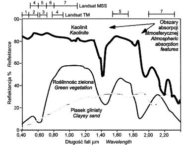
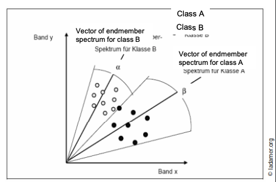
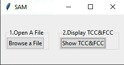
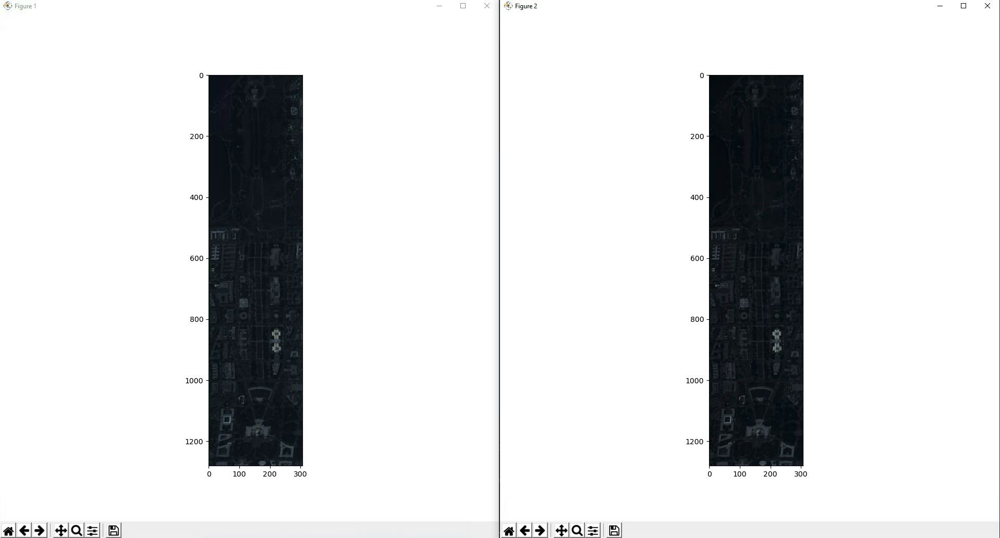
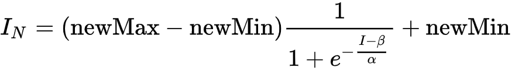
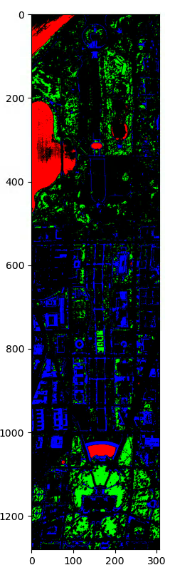
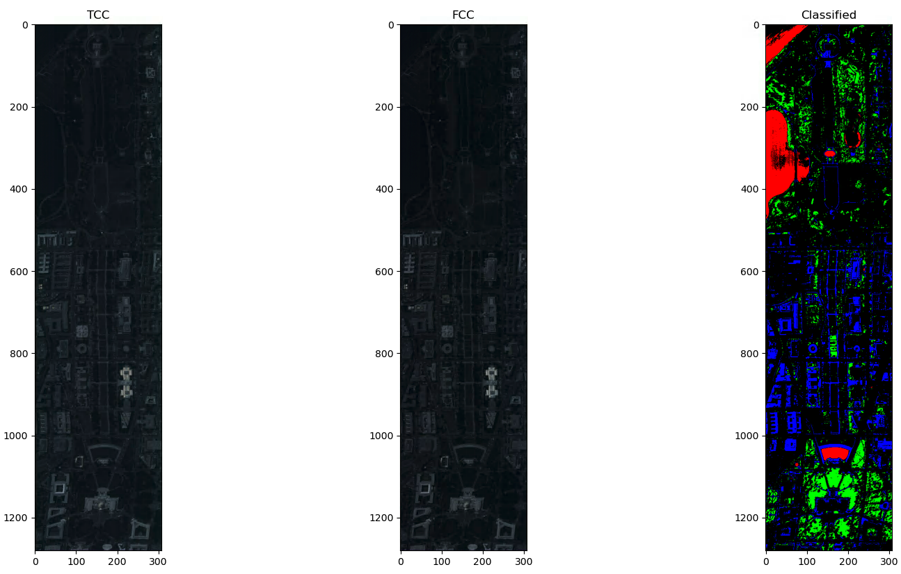
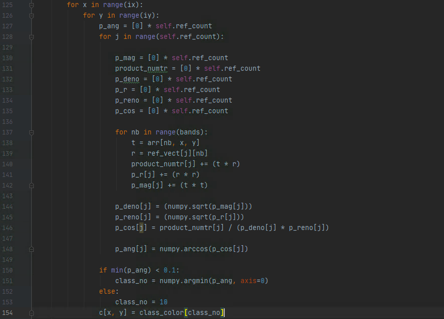
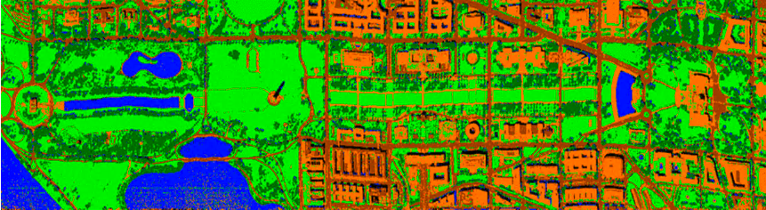

 

Hyperspectral "cube" segmentation using the object's spectral signature

Jacek Ciuba **152082**
June 3, 2020

If you want to contribute to this project feel free to post any PRs.

If this article helped you, please 

Introduction
============

Hyperspectral data
--------------------

The word "hyper" means excessive in size, quality or "over, above". The redundant information results from a very high spectral resolution (narrow recording ranges for individual channels) and a large number of channels in relation to multispectral data, as well as from a very wide range of electromagnetic radiation waves for which a given image is recorded. Most sensors that are called hyperspectral have more than 40 channels with <20 nm spectral resolution.

Hyperspectral systems record radiation reflected from the Earth's surface in dozens or even hundreds of narrow continuous channels, which allows characterizing different types of land cover in more detail than using data obtained by multispectral sensors (Fig. 1).

 

The amount of spectral information recorded by hyperspectral spectometers often exceeds the range required to identify multiple objects. Most hyperspectral airborne sensors, e.g. Hyperion, register electromagnetic radiation for the visible and middle infrared (VIS) ranges (NIR and SWIR). Some of them (e.g. DAIS) have an additional sensor that enables recording also in the thermal range (8000 - 12600 nm) or they register radiation only in this range.

Hyperspectral sensors provide full spectral information about the tested object, as well as bring out features that were previously not possible to obtain. Most objects on the Earth's surface are characterized by the presence of specific features on a curve representing the values ​​of the electromagnetic radiation reflected from them. Most of these features are only possible to capture in very narrow parts of the spectrum that register hyperspectral sensors as separate spectral ranges. This property of hyperspectral images causes that their use to isolate various plant formations significantly increases the accuracy of classification compared to multispectral data.

Application of hyperspectral images
======================================

Geography, geology, cartography and related fields
-----------------------------------------------------

Multispectral imaging is used in geographic information collection systems, especially in Terrain Information Systems. Multispectral data allow to obtain much more complete information about the area than traditional satellite photography. Based on the analysis of light reflected by various parts of the terrain, conclusions can be drawn about the type of rocks, soil composition and humidity, as well as the type of vegetation inhabiting the area (including oceanic vegetation).

Meteorology
------------

Satellite multispectral images are particularly important for meteorology - they allow the study of the distribution of water vapor concentration, as well as the distribution of soil, water and air mass temperatures. The ancestor of multispectral techniques in meteorology were single-channel infrared photographs.

Ecology, forestry, agriculture
------------------------------

Multipsectoral and hyperspectral images are useful in studying the distribution of plant populations, in particular ocean flora and forest stands in forest areas. A thorough analysis of the light reflected from plants allows the detection of the presence of certain species of trees, and also indicates their overall "health".

Surveillance, rescue, searching for objects
-----------------------------------------------

Thanks to multispectral imaging, it is possible to identify partially hidden objects that would be invisible in the image of traditional color cameras or during direct observation.

Criminology
--------------

In forensic technique, multispectral imaging is a tool to accelerate investigative work. Multispectral forensic photographs of crime scene and evidence allow the rapid detection of microtraces of specific organic or chemical substances.

Art history, archeology
----------------------------

In the study of historic works of art, including paintings, books, multispectral imaging is an irreplaceable tool for non-invasive study of the authenticity and hidden content of the work.

Hyperspectral "cube" segmentation by hyperspectral methods
================================================================

In the literature, many scientists present research results obtained on the basis of physical and mathematical modeling, which optimally extracts information from hyperspectral data. The purpose of data analysis is to extract information contained in hyperspectral data, for which the scope and possibilities of image analysis have been significantly expanded due to the increase in spectral resolution. The methods of analysis of hyperspectral data can be divided due to the method of extracting information contained in the pixels of the image. Aspinall divides them into pixel methods and sub-pixel methods. The first group is the procedures that classify a pixel by identifying the main component of a given pixel. These include Spectral Angle Mapper (SAM), Binary Encoding (BE), Spectral Feature Fitting (SFF), Continuum Removed (CR). In contrast, Aspinall's second group includes sub-pixel algorithms that allow estimating the composition of the material within a given pixel, including Linear Spectral Unmixing (LSU), Matched Filtering (MF), Mixture Tuned Matched Filtering (MTMF). A similar division was made by Plaza calling these two groups of procedures techniques of whole pixels and mixed pixels. Plaza also emphasizes that the image should be analyzed using all available methods and algorithms, because within a given scene there are areas where the spectral response may come from a group of spectrally pure pixels or from highly mixed pixels.

Pixel methods for classifying hyperspectral data
------------------------------------------------------

### Spectral Angle Mapper (SAM)

Spectral Angle Mapper (SAM) is a method of automatically comparing spectral curves obtained from the image with the spectral library curves created on the basis of field or laboratory measurements. As reference curves, spectral curves obtained from images (so-called endmembers) or spectral curves from spectral response libraries available from various external sources (e.g. library of USGS laboratories, JPL) can be used. The spectral response values ​​for a pixel in n - channels can be treated as vector coordinates in n - dimensional space. The spectral response of the pattern can also be represented as a vector. The SAM method algorithm is based on a comparison of spectral vectors for each pixel of the analyzed image with spectral vectors for reference objects.

The angle between these vectors is calculated according to the following formula:

\[\alpha = cos^{-1}\left ( \frac{\sum_{i = 1}^{nb} t_{i} r_{i}}{(\sum_{i = 1}^{nb} t_{i}^2)^{\frac{1}{2}} (\sum_{i = 1}^{nb} r_{i}^2)^{\frac{1}{2}}} \right )\]

where:

- \ (\ alpha \) = spectral angle between the standard and the spectral curve of the pixel

- nb = number of spectral channels

- t = vector of spectral response of the standard

- r = the spectral response vector of the analyzed pixel

In this algorithm, the obtained angle is evaluated, not the length of the vector.

 

The advantages of this algorithm are:

- Quick and easy implementation

- Understandable by the user

- Relatively resistant to differences in lighting (topography, light source, sensor, etc.)

- Comparability of image spectra with laboratory spectra

The disadvantages of this algorithm are:

- Lighting tolerance is accompanied by insensitivity to the detection of certain physiological changes

- Similar spectra that only differ significantly in albedo (e.g. coniferous and deciduous forests) are incorrectly classified

Own implementation of the SAM algorithm
==================================

To implement the algorithm, the [code] found on the internet (https://github.com/aditis1204/spectral-angle-mapper) was used, which served as the basis for the project.
It has been completely modified because the author of the program has incorrectly implemented the algorithm.
After a long analysis, the code has been revised to meet the project requirements.

Technology stack
--------------------

The selected programming language is Python with the following libraries:

- rasterio - a library that allows you to import a hyperspectral cube in the .tif format into the program;

- numpy - a library that allows faster operation on arrays

- tkinter - a library that allows you to create an interface for communicating with the user

Graphical interface overview
--------------------------------

After running the program file in a properly configured environment, the user receives a window for communication with the program, allowing to select a hyperspectral cube in .tif format and to display the image *True Colour Composite* and *False Colour Composite*.

 

After selecting the hyperspectral cube file and clicking the *Show TCC & FCC* button, the aforementioned two images will be displayed.

 

The image seems too dark because linear normalization has been used, and normalization should be applied according to the following formula:

 

where \ (\ alpha \) specifies the width of the input intensity range and \ (\ beta \) specifies the intensity around which the range is centered.

However, the implementation of this normalizing algorithm was ignored, because it was not the main problem of this project and from the presented photos you can easily choose the representative pixels for the classes that we want to highlight from the presented FCC image.

In order to select spectral signatures of the classes we are interested in, double-click the left mouse button on the selected pixel.

After choosing the pixels of interest you should close all program windows and wait until it checks all pixels in all layers of the hyperspectral cube. The waiting time for results increases with the number of previously selected representative pixels.
After a while we get the following picture:

 

The pixels marked in red, green and blue represent the previously selected signatures.
The rest of the black pixels were not assigned to any classes.

Finally, a summary of the program operation is displayed, showing a summary of all 3 images:

 

Algorithm implementation
-----------------------

The most important part of the program starts from line 125. The angle values for each pixel in the hyperspectral cube are calculated according to the SAM formula given earlier.

 

It is worth noting here that the angle \ (p \ _cos [j] \) is calculated in radians. Therefore, the constant \ (0.1 \) determines to what level a given pixel is classified into the signature previously set by the user.

Hyperspectral cube used
-----------------------------------

The cube was downloaded from <https://engineering.purdue.edu/~biehl/MultiSpec/hyperspectral.html>.
The cube contains 191 spectral channels for the Washington DC Mall area.

 

Summary
============

The task of the project was to propose and test a method of segmentation of the hyperspectral "cube" downloaded from the Internet using the spectral signature of the object that we want to extract.

I consider the task completed, but while working on this project I encountered many problems before it was completed. Difficulties consisted in finding appropriate educational materials related to the topic, which are very few on the Internet. The only repository I could find among methods using the object's spectral signatures was used to create my implementation of the \ (Spectral Angle Mapper \) algorithm. In the meantime I checked the \ (ISODATA \) and \ (K-means \) methods. The spectral cube used has not been previously prepared for testing, which is the recommended action, but due to the limited time and available resources, only the algorithm \ (SAM \) has been implemented.
Unfortunately, I can't refer to other hyperspectral cube segmenting software because I haven't found it. However, comparing the obtained classification results to the Ground Truth cube, I am able to say that the algorithm has been implemented correctly and I understood the principle of its operation.

Thanks to the implementation of this project, I was introduced to the issues related to the analysis of hyperspectral images, which can certainly be useful during professional work.

9

Claudia Kunzer
*Physical Principles and Methods of Remote Sensing*
<https://earth.esa.int/documents/973910/1002056/CK2.pdf/861e7d6e-dbcf-4209-a29a-e283cc0e67d6>
Universitat Wurzburg, dostęp z 3 czerwca 2020.

Ewa Głowienka - Mikrut
*Analiza porównawcza metod przetwarzania danych hiperspektralnych o zróżnicowanej rozdzielczości.*
<http://home.agh.edu.pl/~galia/research/PhDGlowienkaMikrut.pdf>
Akademia Górniczo Hutnicza, Kraków 2014.

Bogdan Zagajewski, Magdalenia Wrzesień, Marcin Sobczak, Małgorzata Krówczyńska
*Cyfrowe przetwarzanie zdjęć hiperspektralnych.*
<http://geoinformatics.uw.edu.pl/wp-content/uploads/sites/26/2014/03/TS_v36_078_Zagajewski_5.5M.pdf>
Teledetekcja Środowiska 36, Warszawa 2005.

Wikipedia
*Obrazowanie Wielospektralne*
<https://pl.wikipedia.org/wiki/Obrazowanie_wielospektralne>
Dostęp z 3 czerwca 2020.

Wojciech Drzewiecki
*Teledetekcja*
<http://home.agh.edu.pl/~galia/students/NS/teledetekcja_w_skrocie.pdf>
Teledetekcja Środowiska 36, Warszawa 2005.

Piotr Wężyk
*Teledetekcja satelitarna w rolnictwie - wprowadzenie*
Uniwersytet Rolniczy, Kraków 2014.
